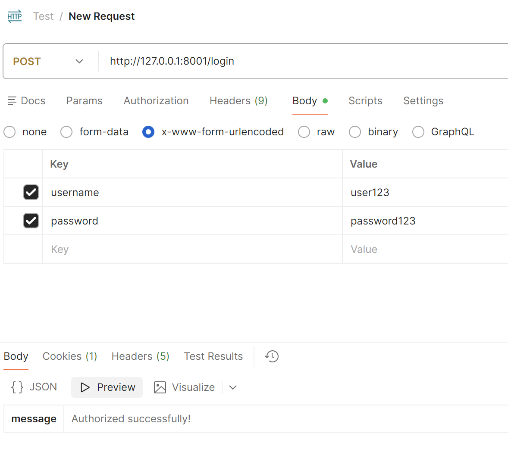
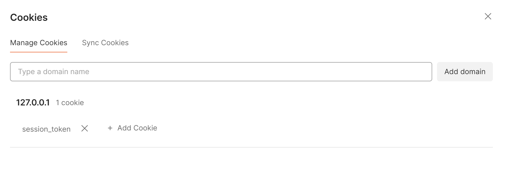
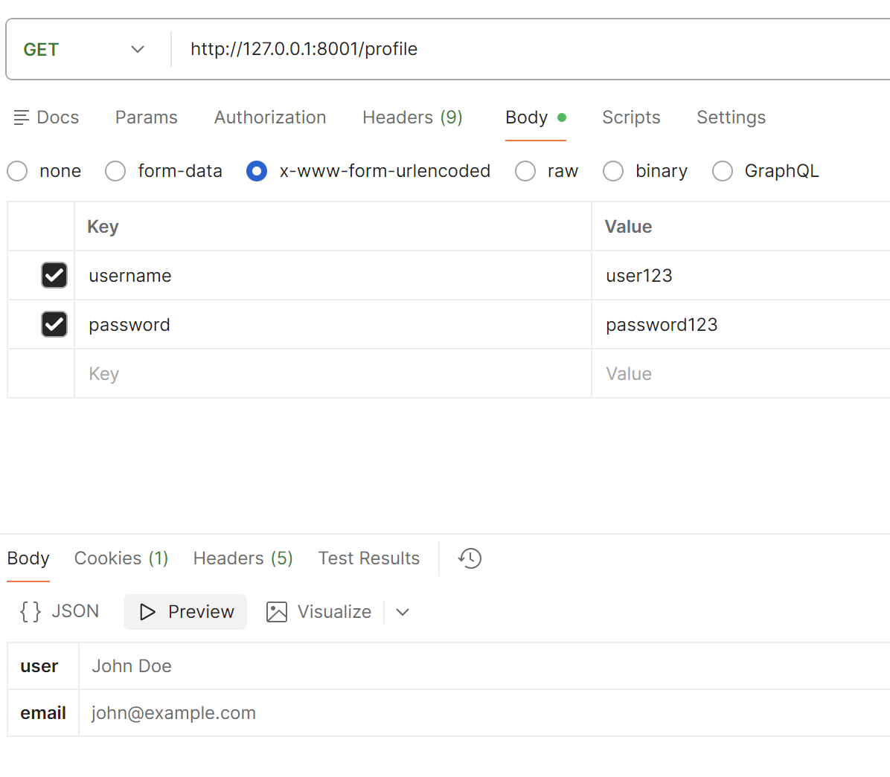
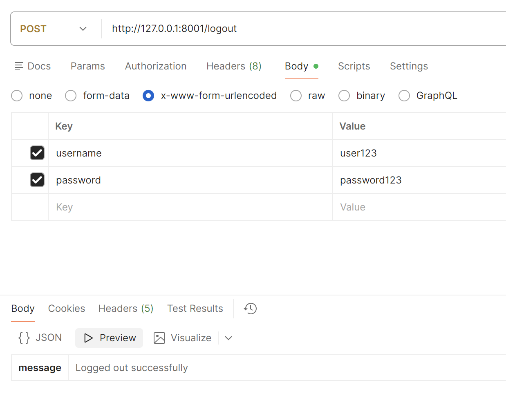
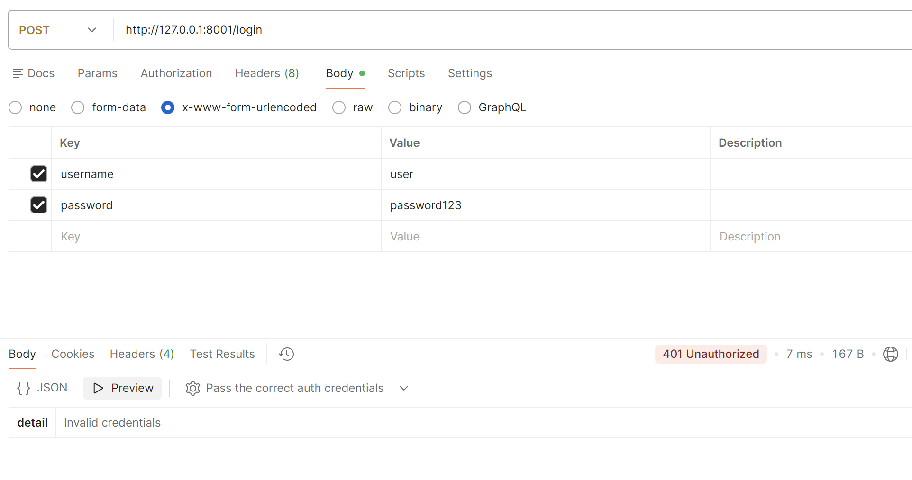
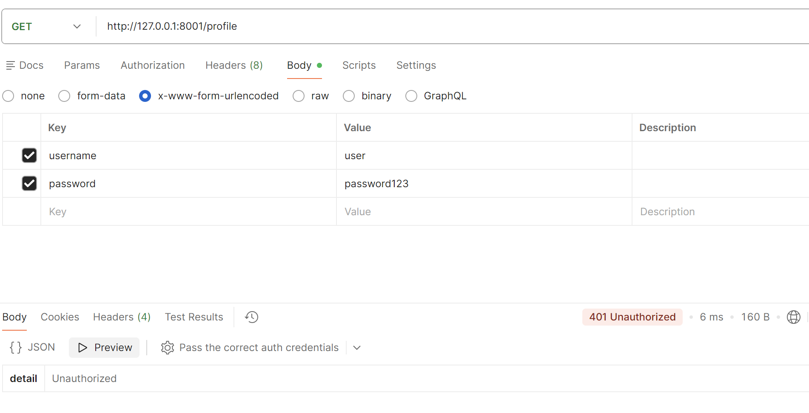
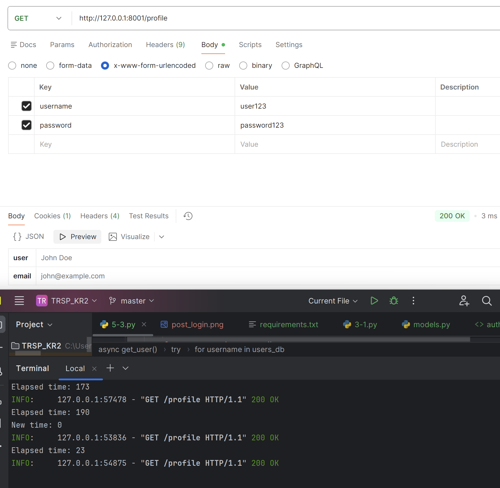

# Контрольная работа 2
Выполнила: Жулева Дарья, ЭФБО-03-24

## Инструкция по запуску
1. Клонировать репозиторий:

git clone https://github.com/mitjink/sadt_kr1  

2. Создать и активировать виртуальное окружение:

### Windows
python -m venv venv  
venv\Scripts\activate

### Mac/Linux
python3 -m venv venv  
source venv/bin/activate

3. Установить зависимости:

pip install requirements.txt

Запустить нужное задание:  

Задание 3.1:  
uvicorn 3-1:app --reload --port 8001  

Задание 3.2:  
uvicorn 3-2:app --reload --port 8002  

Задание 5.1:  
uvicorn 5-1:app --reload --port 8003  

Задание 5.2:  
uvicorn 5-2:app --reload --port 8004  

Задание 5.3:  
uvicorn 5-3:app --reload --port 8005  

Скриншоты для задания 5.3:

На последнем скриншоте можно в консоли отследить "время жизни" куки и увидеть процесс обновления этого времени

